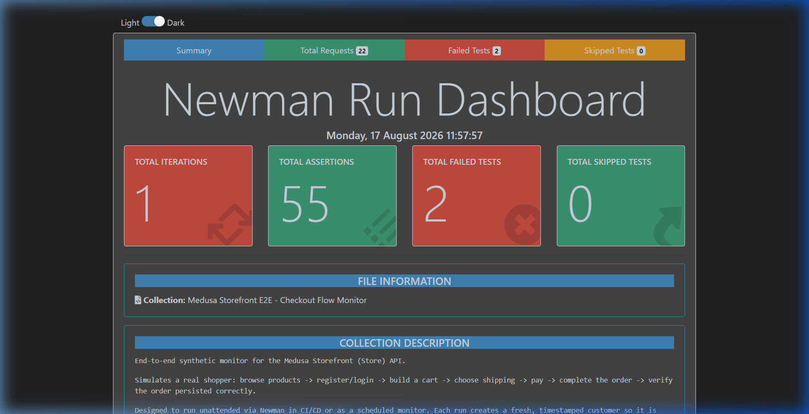

<p align="center">
  
  
  
  
  
</p>

# 🧪 Medusa V2 — QA Portfolio & Testing Case Study

> **This is the main portfolio document** for a full-cycle QA project on [Medusa V2](https://medusajs.com/), an open-source headless e-commerce platform.
>
> The project spans the **entire QA lifecycle** — from test strategy and manual test design, to bug reporting, API testing with Postman/Newman, and a full Selenium + REST Assured automation framework with CI/CD.
>
> The goal was never to write green tests. The goal was to **find real issues** before they reach production.

---

## 📁 Repository Structure

This project is split across two repositories — by design, to mirror how QA documentation and automation code are managed separately in real teams.

| Repository | What's Inside |
|---|---|
| 📋 **[`medusa-qa-portfolio`](https://github.com/Nguyn1710/medusa-v2)**| Test Strategy, Manual Test Cases (Excel), Bug Reports (Jira), Test Metrics & Dashboard |
| 🤖 **[`medusa-v2-automation`](https://github.com/Nguyn1710/medusa-v2-automation)** | Java Automation Framework — Selenium UI + REST Assured API + TestNG + Allure + CI/CD |

---

## 🎯 Project Scope & Objectives

**System Under Test:** Medusa V2 — a production-grade headless e-commerce platform deployed on Railway (backend) and Vercel (storefront).

**Testing covered two surfaces:**

- **Admin Dashboard** — authentication, product management, order management, inventory
- **Customer Storefront** — browse, search, cart, end-to-end checkout, account management

**What this project set out to answer:**
1. Does the system behave correctly for all documented functional requirements?
2. Are there edge cases or negative paths that break expected behavior?
3. Are there security gaps that could expose customer data or bypass access controls?
4. Can we build a maintainable automation layer that catches regressions automatically?

---

## 📊 Testing at a Glance

| Layer | Approach | Volume | Outcome |
|---|---|---|---|
| 📋 Test Design | Manual — Excel-based | 91 Scenarios → 260 Test Cases | 221 Pass / **39 Fail** |
| 🐛 Bug Tracking | Jira (SCRUM board) | 39 confirmed bugs | 1 Security, 38 Functional |
| 📮 API Smoke | Postman + Newman | 22 requests / 55 assertions | 2 failures found |
| 🤖 UI Automation | Selenium + TestNG | 97 test cases | Full regression suite |
| 🔌 API Automation | REST Assured | 66 test cases | Parallel execution |
| ⚙️ CI/CD | GitHub Actions | Every push to `main` | Auto-deploy Allure Report |

**Overall pass rate: 85%** — with 39 confirmed defects logged, triaged, and tracked to resolution.

---

## 🗺️ Test Strategy

### Risk-Based Prioritization

Not all modules carry the same risk. The test effort was distributed based on **business impact × likelihood of failure**:

| Module | Risk Level | Rationale | TC Count |
|---|:---:|---|:---:|
| Auth (Login / Session) | 🔴 High | Entry gate to entire system; session bugs affect all flows | 40 |
| Orders | 🔴 High | Core revenue flow; errors here mean lost sales or data corruption | 58 |
| Products | 🟡 Medium | Frequent data changes; display bugs affect customer trust | 59 |
| Inventory | 🟡 Medium | Stock sync errors cause overselling | 53 |
| Storefront E2E | 🟡 Medium | Customer-facing UX; checkout abandonment risk | 50 |

### Test Types Applied

| Type | Purpose | Example |
|---|---|---|
| ✅ Happy Path | Verify core user journeys work | Login with valid credentials → redirect to `/app/orders` |
| ❌ Negative Testing | Verify the system rejects invalid input gracefully | Login with wrong password → show error, do NOT redirect |
| 🔲 Boundary Testing | Stress edge values | Cart quantity = 0, max character limits on form fields |
| 🔒 Security Testing | Verify auth guards and data isolation | Unauthenticated request to protected endpoint → must return 401 |
| ⚡ Performance SLA | Validate API response time under acceptable threshold | All API responses < 5000ms |
| 💉 Injection Testing | Check resistance to XSS and SQL injection in input fields | Inject `<script>alert(1)</script>` into login email field |

---

## 🐛 Key Bugs Found

> These are not simulated bugs — they were discovered during actual test execution on the live staging environment.

### 🔴 BUG-001 — Security Vulnerability: Unauthenticated Order Access Returns HTTP 200

| Field | Detail |
|---|---|
| **ID** | BUG-001 (Newman: `06 - Negative & Edge Cases > Get Order - No Auth`) |
| **Severity** | 🔴 Critical |
| **Priority** | 🔴 High |
| **Module** | Storefront API — Order Retrieval |
| **Environment** | `https://backend-***.up.railway.app` (staging) |

**What happened:**
When a `GET /store/orders/{id}` request is sent **without any authentication token**, the API returns `HTTP 200 OK` with full order data — instead of the expected `HTTP 401 Unauthorized`.

**Why this matters:**
This is a broken access control vulnerability. In a production environment, an attacker could enumerate order IDs and retrieve sensitive order information (customer name, shipping address, items purchased) belonging to other users — without ever logging in. This maps directly to **OWASP Top 10: A01:2021 — Broken Access Control**.

**Steps to Reproduce (Postman):**
```
GET {{base_url}}/store/orders/{{order_id}}
Headers: (no Authorization header, no session cookie)

Expected: 401 Unauthorized
Actual:   200 OK  +  full order payload
```

**Proposed Fix:**
Add server-side middleware to validate that the requesting session's `customer_id` matches the `customer_id` on the order before returning data. Authentication must be enforced at the route level, not just assumed by the client.

---

### 🟡 BUG-002 — Functional: Session Redirect Not Working on `/app/login`

| Field | Detail |
|---|---|
| **ID** | [SCRUM-8](https://nguyen1710.atlassian.net/browse/SCRUM-8) — `MED_AUTH_TC_004` |
| **Severity** | 🟡 Medium |
| **Priority** | 🟡 Medium |
| **Module** | Admin — Authentication / Session Management |
| **Environment** | `https://backend-***.up.railway.app/app/login` |

**What happened:**
When a user is already authenticated (valid session exists) and manually navigates to `/app/login`, the system should automatically redirect them to `/app/orders`. Instead, the login page is rendered as if the user were unauthenticated — the session is ignored.

**Why this matters:**
This is a UX bug with a security implication. Users with valid sessions are forced to re-authenticate unnecessarily. More importantly, it signals that the frontend is not consistently reading or acting on the session state — which raises questions about other session-dependent flows.

**Evidence:** Video recording attached in Jira ticket SCRUM-8 (MP4, 15MB).

**Proposed Fix:**
Add a session guard at the `/app/login` route level: if a valid auth token exists in cookies/local storage, redirect to `/app/orders` before rendering the login component.

---

### 📋 Bug Distribution by Module

| Module | Total Bugs | Highlight |
|---|:---:|---|
| Auth | 17 | Highest defect density — session handling inconsistencies |
| Orders | 8 | Draft order creation edge cases |
| Products | 7 | UI display bugs on product creation drawer |
| Inventory | 3 | Stock sync display lag |
| Storefront | 4 | Checkout flow, including security bug above |
| **Total** | **39** | |

---

## 🤖 Automation Framework

The automation layer lives in a separate repository to keep concerns clean:

🔗 **[`medusa-v2-automation`](https://github.com/Nguyn1710/medusa-v2-automation)** — full README with architecture, setup, and CI details.

### Why Automation Was Built After Manual Testing

Manual testing ran first — intentionally. Automation was built *after* the system's behavior was understood and the major defects were catalogued. This mirrors the correct professional sequence: you do not automate an unknown system; you automate a known, mostly-stable one.

The 39 bugs found during manual testing informed *which flows* were stable enough to automate and which required closer manual attention.

### Coverage Summary

```
┌──────────────────────────────────────────────────────┐
│            🤖 AUTOMATION: 163 Test Cases             │
├──────────────────────────────────────────────────────┤
│  API Tests (REST Assured)           66 tests         │
│  ├─ Admin API (Auth, CRUD)          36 tests         │
│  └─ Storefront API (Auth/Cart/Order)30 tests         │
│                                                      │
│  UI Tests — Admin (Selenium)        42 tests         │
│  UI Tests — Storefront (Selenium)   55 tests         │
└──────────────────────────────────────────────────────┘
```

### How Manual Tests Map to Automation

The 260 manual test cases served as the specification for automation. The 163 automated cases cover the **stable, high-frequency flows** — primarily smoke and regression paths. The remaining cases require manual execution due to complexity (visual inspection, session-specific flows, exploratory testing).

| Manual Test Cases | Automated | Manual-Only | Automation Rate |
|:---:|:---:|:---:|:---:|
| 260 | 163 | 97 | ~63% |

### Tech Stack

| Tool | Role |
|---|---|
| Java 11 + Maven | Core language & build |
| Selenium WebDriver 4.23 | Browser automation |
| REST Assured 5.4 | API test client |
| TestNG 7.10 | Test execution & grouping |
| Allure 2.28 | HTML reporting |
| Newman (Postman) | API smoke test runner |
| GitHub Actions | CI/CD pipeline |

---

## 📮 API Smoke Testing — Newman Execution Report

The Postman collection was executed via Newman CLI to perform automated smoke testing across the full Storefront E2E Checkout Flow.

| Metric | Value |
|---|---|
| Total Requests | 22 |
| Total Assertions | 55 |
| Assertions Passed | 53 |
| Assertions Failed | **2** (confirmed defects — see BUG-001) |
| Runner | Newman CLI + htmlextra reporter |

- 📊 **Live Interactive Report:** [View Newman HTML Report ↗](https://nguyn1710.github.io/medusa-qa-portfolio/reports/newman-storefront-e2e-report.html)
- 📁 **Source File:** [docs/reports/newman-storefront-e2e-report.html](./docs/reports/newman-storefront-e2e-report.html)



> **Key finding:** The 2 assertion failures directly map to **BUG-001** — the unauthenticated order retrieval endpoint returning `HTTP 200` instead of `401 Unauthorized`. This is the security vulnerability described in the bug section above.

---

## 📂 What's in This Repository

```
medusa-qa-portfolio/
│
├── 📊 Testcases.xlsx              # Manual test cases: 260 TCs, 91 Scenarios, Bug Log, Dashboard
│
├── 📋 docs/
│   ├── test-strategy.md           # Risk-based test approach, scope, entry/exit criteria
│   ├── bug-report-BUG-001.md      # Security bug — full write-up
│   ├── jira-exports/              # SCRUM-8 and other key Jira ticket exports
│   └── reports/
│       └── newman-storefront-e2e-report.html  # Interactive Newman HTML report
│
├── 📸 screenshots/
│   └── newman-report.png          # Newman dashboard screenshot
│
└── README.md                      # ← This file
```

---

## 💡 Key Takeaways & What I Learned

This project was built end-to-end as a QA portfolio piece. The honest takeaways:

**What went well:**
- Risk-based test prioritization helped focus effort where it mattered — Auth and Orders had the highest defect density, which matched the risk assessment.
- Finding the security vulnerability (BUG-001) through negative API testing demonstrated the value of testing what the system *should reject*, not just what it should accept.
- Building automation *after* manual testing prevented automating against unstable or incorrect behavior.

**What I would do differently in a team setting:**
- Establish traceability between manual test cases and automated tests from day one (currently manual and automation are two parallel artifacts, not linked by ID).
- Write bug reports at the time of discovery, not after — the Bug Log in Testcases.xlsx was filled retrospectively, which meant some detail was lost.
- Involve automation earlier in the sprint cycle as a regression net, rather than building it all at the end.

---

## 👤 About

**Nguyen Le** — QA Engineer (Entry Level)

Background in software development (~1 year), transitioning fully into QA/QC. This project was built to demonstrate hands-on testing skills across the full QA lifecycle: test design, manual execution, bug reporting, API testing, and automation.

- 🔗 Automation Repo: [github.com/Nguyn1710/medusa-v2-automation](https://github.com/Nguyn1710/medusa-v2-automation)
- 🐛 Bug Tracker: [nguyen1710.atlassian.net](https://nguyen1710.atlassian.net/browse/SCRUM-8)

---

<p align="center">
  <i>Built to find real issues — not just write green tests.</i>
  <b>Built with ❤️ for QA Learning</b><br/>
</p>